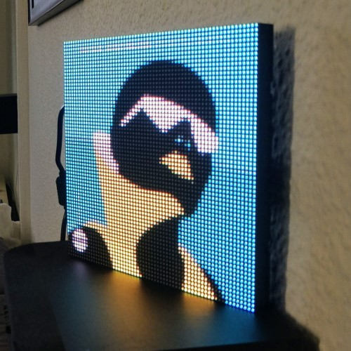

# SporArtPy
### Show the album cover of the currently playing song on a 64x64 LED Matrix

## External Tools / Libraries
Spotipy: https://github.com/plamere/spotipy  
For easy use of the Spotify API

Flaschen Taschen: https://github.com/hzeller/flaschen-taschen  
For rendering of images / gifs onto the RGB Matrix 

## Assembly
I used a 64x64 Matrix by Adafruit, their Raspberry PI bonnet and a Raspberry PI Zero 2 W  
I also tried using a 1st gen Raspberry Pi Zero W but that was way slower, especially when starting the script.  
For assemlby use this tutorial: https://learn.adafruit.com/adafruit-rgb-matrix-bonnet-for-raspberry-pi/

## Different Parts of the Application
### `SpotifyListener.py`
Python script which polls your current playback status from spotify, downloads the images and sends them to the rgb-matrix  
Needs the flaschen-taschen server to be running and have a compiled version of `send-image` in the same folder  
Also requires to have an app created at https://developer.spotify.com/ and will ask for the client ID and secret. This information will be saved locally.

### `BrightnessController`
ASP.NET Core Server application to receive HTTP requests for changing the brightness.  
Can be used via any Rest api client (for example Postman) or the Brightness Controller App.  
For my usecase this runs on the same Raspi as the python script.

### `brightness_controller_app`
Flutter app for sending brightness change requests to the server.  
IP is hardcoded to fit with my local network setup - change if needed.

https://user-images.githubusercontent.com/6205477/178051174-5d4dbac5-4de8-4d1e-b692-94b98b012b92.mp4

[Voidsailor - Transistor](https://open.spotify.com/album/1YsEAYZGJ0qzLmqXOXdh3f)
